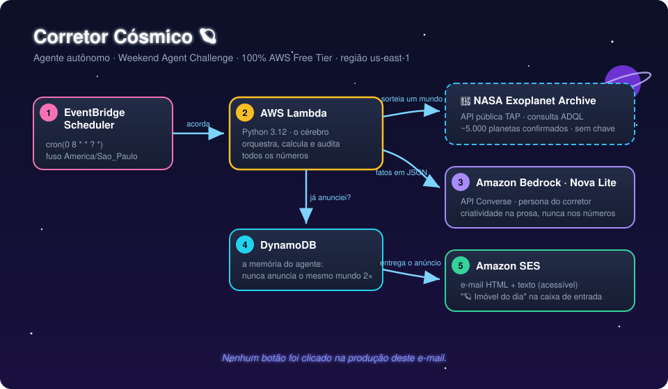

# Corretor Cósmico 🪐

> Um agente autônomo na AWS que, todo dia, escolhe um exoplaneta **real** do catálogo da NASA e me envia por e-mail o "imóvel do dia" — escrito por IA no tom de um corretor de imóveis intergaláctico.

Construído para o **AWS Builder Center — Weekend Agent Challenge** (Build an Always-On Agent).

## O que ele faz, sozinho, todo dia às 8h

1. ⏰ O **EventBridge Scheduler** acorda o agente (nenhum botão é clicado).
2. 🔭 A **Lambda** consulta o **NASA Exoplanet Archive** (API pública TAP, com retry e backoff) e sorteia um exoplaneta confirmado.
3. 🧠 Consulta sua **memória no DynamoDB** para nunca anunciar o mesmo mundo duas vezes.
4. 🧮 Calcula distância em anos-luz e tempos de viagem (Voyager 1 e 10% da velocidade da luz) — **a IA não faz contas**: todo número nasce em Python auditável.
5. ✍️ O **Amazon Nova Lite (Bedrock)** escreve o anúncio épico usando apenas os dados reais.
6. 📬 O **Amazon SES** entrega em HTML estilizado + texto puro (acessibilidade também é engenharia).

## Arquitetura



| Serviço | Papel |
|---|---|
| EventBridge Scheduler | Gatilho autônomo (cron diário, fuso de São Paulo) |
| AWS Lambda (Python 3.12) | Orquestra tudo: NASA → memória → cálculos → IA → e-mail |
| Amazon DynamoDB | Memória do agente (nunca repete um planeta) |
| Amazon Bedrock (Nova Lite) | Gera o texto do anúncio via API Converse |
| Amazon SES | Entrega por e-mail (HTML + texto) |
| NASA Exoplanet Archive | Fonte de dados (pública, sem chave) |

## Estrutura do repositório

```
├── lambda_function.py      # Código do agente
├── iam_policy.json         # Permissões mínimas da Lambda
├── arquitetura.svg         # Diagrama
```

## Exemplo de saída

> **🪐 Imóvel do dia: Proxima Cen b**
> A apenas 4,2 anos-luz — praticamente o vizinho de porta da humanidade! Ano de 11 dias: você faz aniversário 33 vezes por ano terrestre...

## Licença

MIT — use, adapte e encontre seu próprio lar entre as estrelas. ✨
